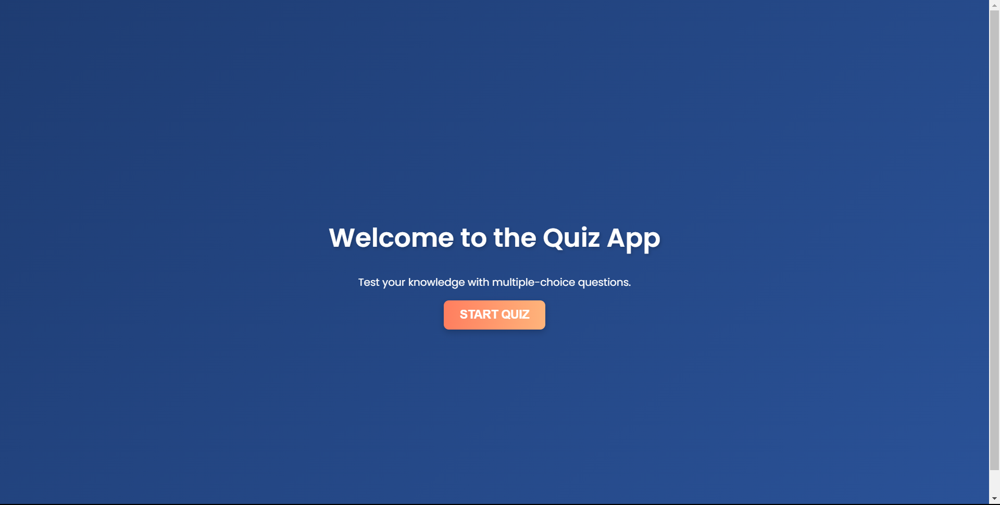
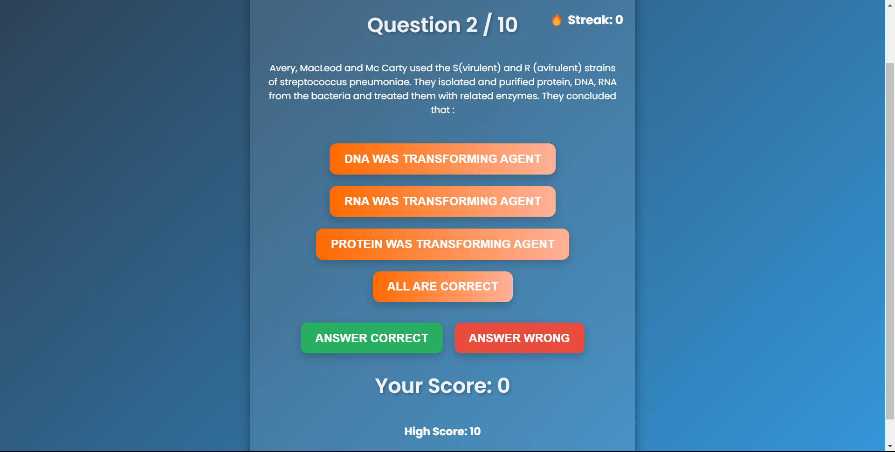
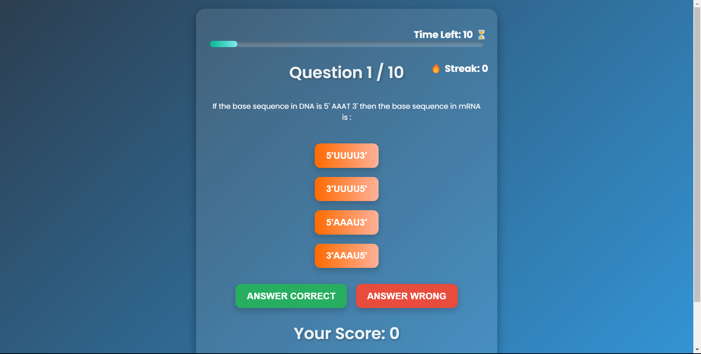
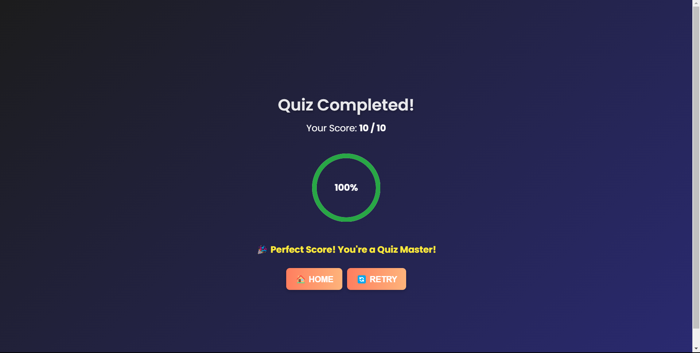

# 🧠 Quiz App with Gamification 🎮  

## 🚀 Overview  
This is a web-based **quiz application** built using **React.js** with **gamification features** to enhance user engagement. The app fetches quiz questions from an API and provides an interactive experience with animations and score tracking.  

## 🔥 Features  
✅ Fetches quiz data from an API using Axios  
✅ Multiple-choice questions with instant feedback  
✅ Score calculation and high-score tracking using local storage  
✅ Gamification elements like animations  
✅ Responsive design for all devices  

## 📜 Installation & Setup  
Follow these steps to run the project locally:  

### 1️⃣ Clone the Repository  
- git clone https://github.com/njg37/quiz-app.git
- cd your_project_folder

### 2️⃣ Install Dependencies
- npm install

### 3️⃣ Start the Development Server
- npm start

The app will run on http://localhost:3000/.

## 🖼 Screenshots
  
  
  
  

## 🎥 Demo Video
📺 Watch the demo video here: https://drive.google.com/file/d/1QRBtFms4NLCHX0m8Tk1VDeadYpimuSw6/view?usp=sharing

## 📌 Technologies Used
- React.js ⚛️
- Axios for API requests
- Framer Motion for animations
- Local Storage for high-score tracking

🎉 Thank you! 🚀 Enjoy the quiz!

